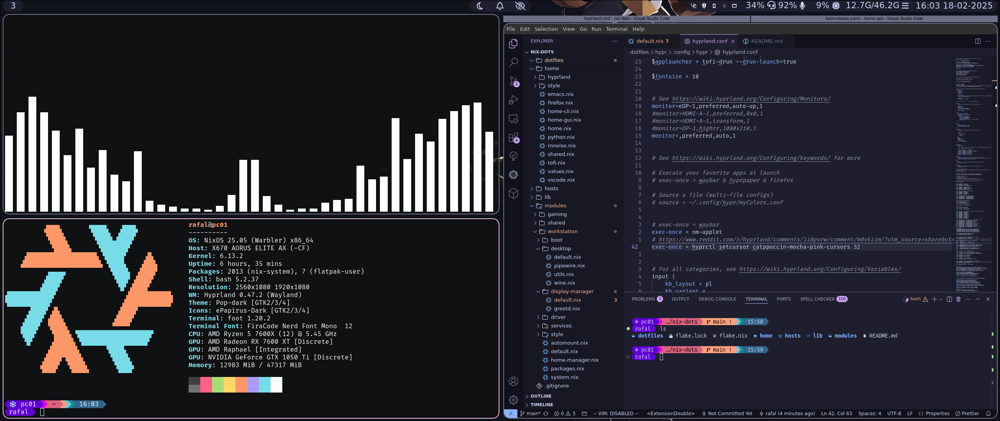

# Quick install

In [NixOs Live CD](https://nixos.org/download/)

1. Mount partitions at `/mnt`
1. `nixos-generate-config --root /mnt`
1. `cp /mnt/etc/nixos/hardware-configuration.nix /etc/nixos/`
1. `nix-shell -p git`
1. `git clone <THIS_REPO_URL>` replace `<THIS_REPO_URL>` with URL to this repository
1. `cd` into repository directory cloned in previous step
1. `sudo nixos-install --flake './#local-hardware-config' --impure`
1. reboot

## Resources Links

<https://search.nixos.org/packages?channel=unstable>

<https://search.nixos.org/options?channel=unstable>

<https://home-manager-options.extranix.com/?query=&release=master>

<https://noogle.dev/>

<https://nixpk.gs/pr-tracker.html>

## Standalone Nix home manager

Nix command and flakes support has to be enabled.

```sh
mkdir -p ~/.config/nix
echo 'experimental-features = nix-command flakes' >> ~/.config/nix/nix.conf
```

Nix home-manager config provides cli part of config only. As gui has host system dependencies and workarounds. For GUI configuration use stow-able dotfiles.

```sh
nix run home-manager/master -- switch --flake .
```

## Standalone stow-able dotfiles

To apply using [go-task](https://taskfile.dev/) run `task setup-dotfiles`.

Files can be applied manually too using stow, that's what aftermentioned task does.

# Structure

[./dotfiles](./dotfiles) regular stow-able dot files

[./home](./home) nix home-manager home configuration.
It is split into two main files [home-cli](./home/home-cli.nix) and [home-gui](./home/home-gui.nix).
Which are responsible for command-line-interface and graphical user interface respectively.

By default [home.nix](./home/home.nix) should be used which imports both. If host systems has GUI dependencies, otherwise CLI only config should be used.

[/hosts](./hosts) Contains host specific configurations.

[./lib](./lib) Contains function used to define nixOS systems outside of main [flake](./flake.nix) module.

[./modules](./modules) Modules which could be called workflows.

[./pkgs](./pkgs) Custom pkgs.
